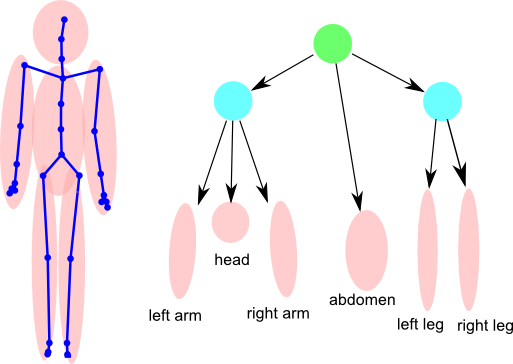
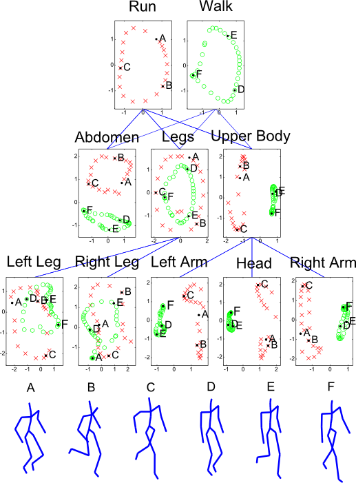

# hgplvm

## Hierarchical Gaussian Process Latent Variable Model - MATLAB Software

# Hierarchical GP-LVM Software

This page describes examples of how to use the hierarchical Gaussian process latent variable model Software (HGPLVM). 

The hierarchical GP-LVM allows you to create hierarchies of Gaussian process models. With the toolbox two hierarchy examples are given below.

### Examples

Two examples of hierarchical models are provided with the code, the first is an example where two interacting subjects are jointly model. Two subjects from the <a href="http://mocap.cs.cmu.edu">CMU Mocap data base</a> approach each other and 'high five'. The hierarchy models the subjects separately and jointly. It can be run with the command

```matlab
>> demHighFive1
```

A visualisation of the result, including points that have been propagated through the hierarchy is given below.

<center><br>

Joint visualisation of the two subjects that 'high five'. The points A, B, C, D, E, F, G and H have been propagated through the hierarchy and are shown on the right. Grey scale visualisations in the latent space have not been shown to keep the smaller plots clear.</center>

A second example involves a subject modelled running and walking. In this case the separate limbs of the subject are split into a hierarchy as shown below.

<center><br>Hierarchical decomposition of the skeleton. The limbs and abdomen are leaf nodes, behind which we build a hierarchical structure.</center>

This example can be reconstructed with
```matlab
>> demWalkRun1
```

Results of applying the hierarchical structure to a combined data set of a run and a walk, using two root nodes, one for the run and one for the walk, are shown below.

<center><br>
Visualisation of a walk and run jointly using hierarchical structures. Again several points have been propagated through the hierarchy.
</center>

